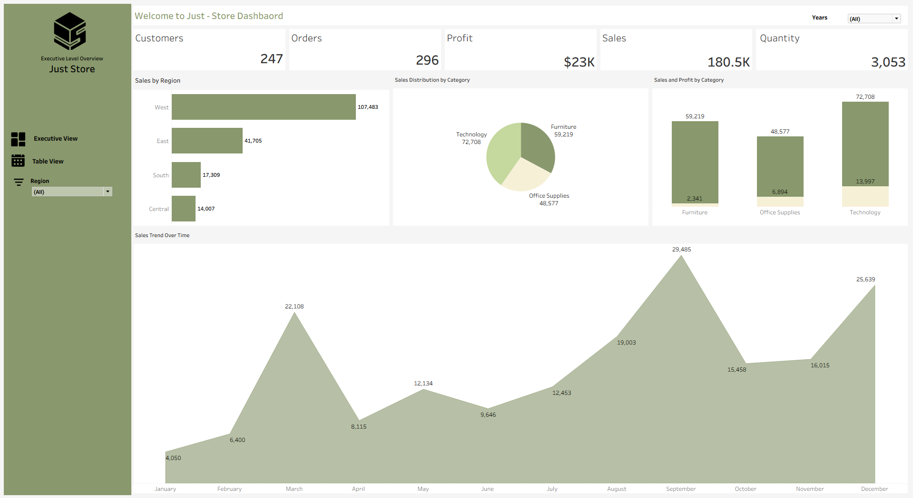

# Just-Store Sales Performance & Profitability Analysis

## Project Overview
This project was born out of a classic retail challenge: Just-Store is growing fast across multiple regions, but leadership was flying blind when it came to tracking where they were actually making money versus where they were just spinning their wheels.

To solve this, I built an interactive, end-to-end management dashboard in Tableau Public. The goal wasn't just to make pretty charts, but to create a single, reliable workspace that exposes hidden profit drains, highlights regional performance gaps, and maps out predictable sales cycles so the management team can make proactive, data-backed decisions.

## Interactive Dashboard Preview

### Fig. 1: Sales Performance

## Live Dashboard Link
Explore the Interactive Workbook: https://public.tableau.com/views/Just-StoreDashboard_17803956490720/ExecutiveView?:language=en-US&:sid=&:redirect=auth&:display_count=n&:origin=viz_share_link

## The Core Business Problems | Tackled
Looking at the business requirements, the company was hitting a few major roadblocks:

- Imbalanced Growth: Sales were booming in some areas but completely lagging in others, with no clear visibility into why.

- The "Vanity Metric" Trap: High sales volumes in certain categories looked great on paper but were masking incredibly weak profit margins.

- Predictability Hurdles: A lack of clear historical trend tracking made it difficult for the supply chain and marketing teams to plan for seasonal spikes.

## Inside the Dashboard: Design & Features
I designed the dashboard using a clean, professional sage-green palette ensuring the layout is scannable for an executive user.

### Project Structure
├── data/

│   └── dataset

├── images/

│   └── Dashboard_Snapshot.png

└── README.md

## What I Built:
- The High-Level Pulse: A clean KPI header giving an instant snapshot of the business health: 247 customers, 296 orders, $180.5K in sales, and $23K in net profit.

- Modern Interface & Navigation: Instead of cluttering the screen, I built a custom, left-aligned sidebar menu. Users can effortlessly switch between the high-level Executive View and a granular Table View for row-level auditing.

- Seamless Interactivity: I implemented synchronized global filters for Years and Regions. A stakeholder can click any region in the sidebar, and the entire dashboard instantly updates to reflect that market.

## Real Insights That Impact the Bottom Line
Through the building phase and visual analysis of the dashboard in Fig. 1, I uncovered three major operational insights:

1 The Furniture Margin Trap
The Issue: The Furniture category is a massive revenue driver, pulling in $59,219 (roughly a third of all sales). However, it only brought in a tiny $2,341 in actual profit. Compare that to Technology, which brought in $72,708 in sales but kept a massive $13,997 in profit.

The Fix: The dashboard clearly shows that Furniture has a cost or discounting problem. Management needs to immediately re-evaluate shipping fees, supplier costs, or promotional strategies for this category.

2 The West Coast Engine
The Issue: The West region is absolutely carrying the business, generating $107,483 in sales more than the East, South, and Central regions combined.

The Fix: We need to figure out what the West team is doing right and duplicate that playbook in the underpenetrated Central ($14,007) and South ($17,309) regions.

3 High-Definition Seasonality
The Issue: Sales are not random, they follow a strict cyclical pattern. Demand explodes in September ($29,485) and peaks again in December ($25,639), with noticeable slumps in spring and early summer.

The Fix: Armed with this data, the operations team can optimize inventory levels, ramping up stock and marketing spend 30 to 60 days before the September and December rushes to avoid stockouts and capture every bit of revenue.

## Tools Used
- BI & Visualisation: Tableau Public
- Framework: Business Intelligence & Executive Reporting Standards
